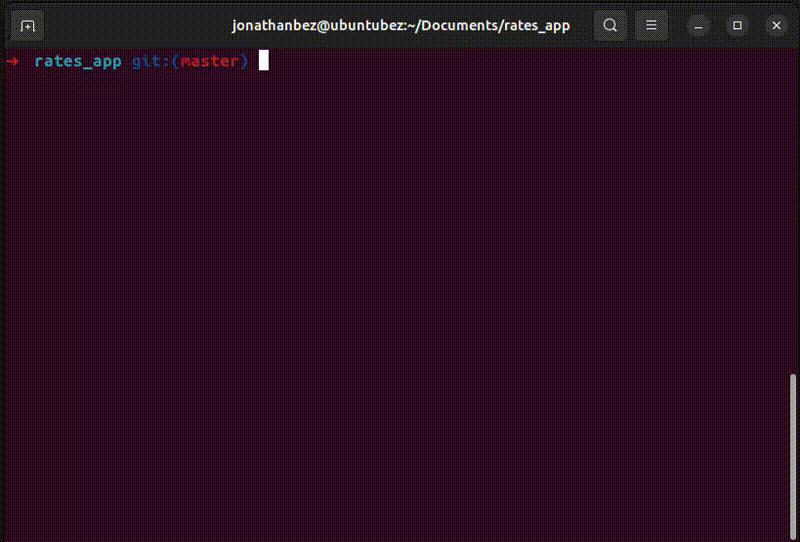

<h3 align="center">
  RATES APP
</h3>

<p align="center">
  

 <a href="https://www.linkedin.com/in/jonathan-bezerra-b483b6148/">
  
 </a>
  
  
  <a href="https://github.com/Jonathanbez/rates_app">
    
  </a>
  
  
<p align="center">
  <a href="#-about-the-project">About the project</a>&nbsp;&nbsp;&nbsp;|&nbsp;&nbsp;&nbsp;
  <a href="#-technologies">Technologies</a>&nbsp;&nbsp;&nbsp;|&nbsp;&nbsp;&nbsp;
  <a href="#-getting-started">Getting started</a>&nbsp;&nbsp;&nbsp;|&nbsp;&nbsp;&nbsp;
  <a href="#-how-to-contribute">How to contribute</a>&nbsp;&nbsp;&nbsp;|&nbsp;&nbsp;&nbsp;
  <a href="#-license">License</a>
</p>

[]

## 👨🏻‍💻 About the project

- <p style="color: red;">Simple script for get convert or know the exchange rate of your currency.</p>

## 🚀 Technologies

Technologies that I used to develop this software:

- [Ruby](https://ruby-doc.org/)

## 💻 Getting started

### Requirements

- git (just clone this repo)
- ruby 2.5.1
- bundler (`gem install bundler`)
- ccount on [Fixer](https://fixer.io/#pricing_plan)
- OS Linux (only test on Ubuntu 23.10)

## Começando
```bash
#clone the project
git clone https://github.com/Jonathanbez/rates_app.git

#enter the directory
cd rates-app

#install dependencies
bundle install

#execute 
ruby rates_app.rb
```

[](https://www.youtube.com/watch?v=405zS5PAL3U)

## 📝 License

This project is licensed under the MIT License - see the [LICENSE](LICENSE) file for details.

---

Made with 💜 &nbsp;by Jonathan Bezerra 👋 &nbsp;[See my linkedin](https://www.linkedin.com/in/jonathan-bezerra-b483b6148/)
